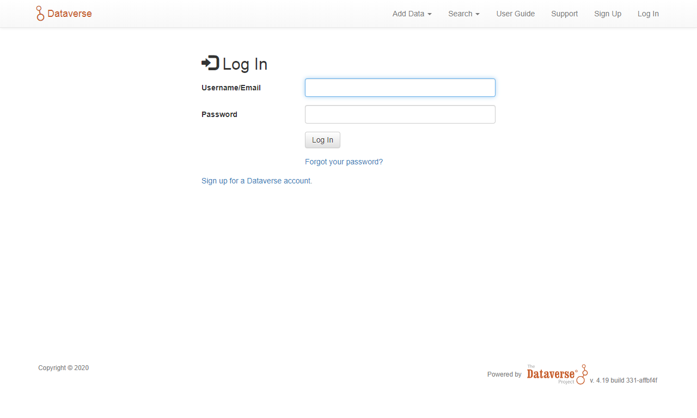

<a href="http://www.ibict.br" target="_blank"></a> <a href="https://dataverse.org" target="_blank"></a>

> Este manual foi elaborado inicialmente pela equipe de bolsistas do [**Instituto Brasileiro de Informação em Ciência e Tecnologia (Ibict)**](http://www.ibict.br/){:target="_blank" rel="noopener"}, e aberto à comunidade brasileiro de usuários do [Dataverse](https://dataverse.org/){:target="_blank" rel="noopener"}.

# Contribuidores

[Lista completa de contribuidores](./contribs.md){:target="_blank" rel="noopener"}.

# Instalação

O Sistema Operacional utilizado neste tutorial de instalação foi o Linux, distribuição **Debian 10**. 
Esse sistema operacional foi escolhido por ser um dos mais utilizado em servidores de instituições acadêmicas. 
Os programas são instalados utilizando o programa gestor de pacotes _APT_, 
 contudo, por conta de problemas de compatibilidade, alguns programas serão instalados manualmente.

>**O procedimento de instalação do Dataverse descrito a seguir exige noções básicas de redes de computadores e comandos executados no terminal do Sistema Operacional Linux**.


## Tabela com  as versões dos sistemas e programas utilizados

| Sistema/Programa    | Versão requerida | Versão utilizada    |
| :------------------ | :--------------- | :------------------ |
| Sistema operacional | Linux            | Debian 10.3.0 Amd64 |
| Dataverse           | >= 4.11          | 4.19                |
| Java (JDK)          | >= 1.8.0_u74     | openjdk 1.8.0_u242  |
| Glassfish           | 4.1              | 4.1                 |
| PostgreSQL          | >=10.0           | 11.7                |
| Apache-Sorl         | 7.3.1            | 7.3.1               |
| jq                  | 1.5              | 1.5                 |
| ImageMagick         | 8:6.9            | 8:6.9               |
| R                   | >= 3.0.0         | 3.6.3               |
| Counter Processor   | >= 0.0.1         | 0.0.1               |
| Python              | >= 3.6           | 3.7.3-1             |


## Pré-requisitos

É necessário a autorização de administrador ou de _superusuário_ em algumas etapas da instalação, 
com isso, recomenda-se estar logado como `root` durante a instalação, ou possuir usuário com `sudo` configurado. 


Para instalar e configurar o ``sudo``, basta executar passos descritos a seguir.

```shell
$ su -
```

Inserir a senha de ``root`` e executar.

```shell
# apt install sudo

# nano /etc/sudoers
```


> Nos comandos e edições dadas abaixo, substitua o nome ``user`` pelo nome do usuário que está realizando o procedimento de  instalação.


Acrescentar abaixo de ``root    ALL=(ALL:ALL) ALL`` a linha ``user    ALL=(ALL:ALL) ALL``.


Agora saia do usuário de ``root``.

```shell
# exit
```


A primeira coisa a se fazer é atualizar a base de dados do gestor de pacotes:

```shell
$ sudo apt update
$ sudo apt upgrade
```


Em seguida, devem ser instalados os pacotes e programas básicos, que serão utilizados durante a instalação, tais como a ferramenta de transferência de dados _curl_. Responda sempre ``S`` as perguntas realizadas.

```shell
$ sudo apt install dirmngr --install-recommends

$ sudo apt install curl postgresql postgresql-contrib jq imagemagick gfortran libreadline-dev xorg-dev libbz2-dev liblzma-dev libblas-dev libpcre++-dev libcurl4-gnutls-dev software-properties-common apt-transport-https python3 python3-pip python3-peewee python3-geoip2 python3-dateutil python3-yaml
```


Crie um usuário de nome ``dataverse``  para vinculá-lo aos pacotes baixados e à instalação da instância do Dataverse:

```shell
$ sudo useradd -m dataverse
```


Ao se criar o usuário, também será criada uma pasta no diretório `/home/` como o nome `dataverse`.  É necessário mudar as permissões da pasta `/home/dataverse` para que o usuário que executa a instalação possa salvar arquivos e realizar modificações neste diretório. Substitua `user` pelo nome do usuário que executa a instalação e proceda com o seguinte comando:

```shell
$ chown -R user:user /home/dataverse
```


Acesse a pasta `` /home/dataverse``  e crie um diretório temporário ``temp``, onde serão baixados alguns dos programas e pacotes necessários para a instalação.

```shell
$ cd /home/dataverse
$ mkdir temp 
$ cd temp
```


### Baixando o pacote de instalação e o código fonte do Dataverse

O pacote de instalação do Dataverse deve ser baixado e descompactado dentro da pasta ``/home/dataverse/temp``.
```shell
$ cd /home/dataverse/temp

$ curl -L -O https://github.com/IQSS/dataverse/releases/download/v4.19/dvinstall.zip

$ curl -L -O https://github.com/IQSS/dataverse/archive/v4.19.zip

$ unzip dvinstall.zip

$ unzip v4.19.zip
```


Mova a pasta recém-criada ``dvinstall`` para dentro do diretório ``/home/dataverse/`` . 

```shell
$ mv dvinstall /home/dataverse/

$ mv dataverse-4.19 /home/dataverse/
```


### Java  (JDK)

O pacote _JDK_ é instalado via _APT_, mas necessita de uma atualização na lista de fontes de pacotes.  Execute a seguinte lista de comandos:

```shell
$ cd /home/dataverse/temp

$ wget -qO - https://adoptopenjdk.jfrog.io/adoptopenjdk/api/gpg/key/public | sudo apt-key add -

$ sudo add-apt-repository --yes https://adoptopenjdk.jfrog.io/adoptopenjdk/deb/

$ sudo apt update

$ sudo apt install adoptopenjdk-8-hotspot
```


Caso exista mais de uma opção de _JDK_, é necessário selecionar a recém-instalada por meio do comando:

```shell 
$ sudo update-alternatives --config java
```

Um exemplo de reposta no terminal é:

```shell
Existem 3 escolhas para a alternativa java (disponibiliza /usr/bin/java).

  Selecção   Caminho                                             Prioridade Estado
------------------------------------------------------------
  0            /usr/lib/jvm/java-11-openjdk-amd64/bin/java          1111      modo automático
  1            /usr/lib/jvm/adoptopenjdk-8-hotspot-amd64/bin/java   1081      modo manual
  2            /usr/lib/jvm/java-11-openjdk-amd64/bin/java          1111      modo manual
* 3            /usr/lib/jvm/jdk-13.0.2/bin/java                     2         modo manual
```

Nesse caso deve-se selecionar a opção ``3``.

Se a opção selecionada estiver correta, ao se executar o comando: 

```shell
$ java -version
```

o terminal deverá fornecer como resposta:

```shell
openjdk version "1.8.0_242"
OpenJDK Runtime Environment (AdoptOpenJDK)(build 1.8.0_242-b08)
OpenJDK 64-Bit Server VM (AdoptOpenJDK)(build 25.242-b08, mixed mode)
```


### Glassfish

Primeiro, baixe o programa _Glassfish_,  versão 4.1, dentro da pasta `/home/dataverse/temp`.

```shell
$ cd /home/dataverse/temp/

$ curl -L -O http://download.oracle.com/glassfish/4.1/release/glassfish-4.1.zip
```


Descompacte o arquivo baixado.

```shell
$ unzip glassfish-4.1.zip
```


Mova a pasta automaticamente criada `glassfish4` para `/usr/local`.

```shell
$ sudo mv glassfish4 /usr/local/
```


Remova o arquivo `weld-osgi-bundle.jar`, localizado no diretório `/usr/local/glassfish4/glassfish/modules/`.

```shell
$ rm /usr/local/glassfish4/glassfish/modules/weld-osgi-bundle.jar
```


Baixe a nova versão do arquivo removido dentro de `/home/dataverse/temp`.

```shell
$ curl -L -O https://search.maven.org/remotecontent?filepath=org/jboss/weld/weld-osgi-bundle/2.2.10.Final/weld-osgi-bundle-2.2.10.Final-glassfish4.jar
```


Copie o novo arquivo baixado `weld-osgi-bundle-2.2.10.Final-glassfish4.jar` para dentro do diretório `/usr/local/glassfish4/glassfish/modules/`.

```shell
$ cp weld-osgi-bundle-2.2.10.Final-glassfish4.jar /usr/local/glassfish4/glassfish/modules/
```


Edite o arquivo  `domain.xml` localizado na pasta `/usr/local/glassfish4/glassfish/domains/domain1/config/`, alterando de `-client` para `-server` a tag `<jvm-options>-client</jvm-options>`.

```shell
$ nano /usr/local/glassfish4/glassfish/domains/domain1/config/domain.xml
```

Alterar de:

```xml
        <jvm-options>-client</jvm-options>
```

Para:

```xml
        <jvm-options>-server</jvm-options>
```


Copie os certificados de segurança atualizados no pacote _JDK_ 11 instalado para dentro da pasta `/usr/local/glassfish4/glassfish/domains/domain1/config/`.

```shell
$ cp /usr/lib/jvm/adoptopenjdk-8-hotspot-amd64/jre/lib/security/cacerts /usr/local/glassfish4/glassfish/domains/domain1/config/cacerts.jks
```


Crie o usuário ``glassfish`` e ajuste as permissões dor arquivos armazenados na pasta ``/usr/local/glassfish4/``.

```shell
$ sudo useradd -m glassfish

$ sudo chown -R root:root /usr/local/glassfish4

$ sudo chown -R glassfish:glassfish /usr/local/glassfish4/glassfish/domains/domain1
```


Inicie a execução do _Glassfish_.

```shell
$ sudo /usr/local/glassfish4/bin/asadmin start-domain
```

Verifique a versão do programa _Weld_ em execução,

```shell
$ sudo /usr/local/glassfish4/bin/asadmin osgi lb | grep 'Weld OSGi Bundle'
```

Resposta esperada no terminal:

```shell
50|Resolved   |    1|Weld OSGi Bundle (2.2.10.Final)
```


### PostgreSQL ###

Se este tutorial está sendo seguido desde seu início, o gerenciador de banco de dados _PostgreSQL_ já foi instalado via a ferramenta _APT_. No entanto algumas configurações adicionais são necessárias para seu correto funcionamento. Edite o arquivo `pg_hba.conf` localizado na pasta `/etc/postgresql/[versão do postgresql]/main/`.

```shell
$ sudo nano /etc/postgresql/[versão_postgresql]/main/pg_hba.conf
```

Altere ao final do arquivo a linha:

```powershell
# IPv4 local connections:
host all all 127.0.0.1/32 md5
```

Para:

```powershell
# IPv4 local connections:
host all all 127.0.0.1/32 trust
```

Reinicie o _PostgresSQL_ por meio do seguinte comando.

```shell
$ sudo /etc/init.d/postgresql restart
```


### Apache-Solr

O programa _Apache-Solr_  deve ser baixado e descompactado na pasta ``/home/dataverse/temp``.

```shell
$ cd /home/dataverse/temp

$ curl -L -O https://archive.apache.org/dist/lucene/solr/7.3.1/solr-7.3.1.tgz

$ tar -vzxf solr-7.3.1.tgz
```


Mova pasta recém-criada ``solr-7.3.1``, renomeando-a somente para ``solr``, para dentro da pasta ``/home/dataverse/`` .

```shell
$ mv solr-7.3.1/ /home/dataverse/solr
```


Copie os arquivos de configuração padrão e do  Dataverse para a pasta ``collection1`` da aplicação _Apache-Solr_.

```shell
$ cp -r /home/dataverse/solr/server/solr/configsets/_default /home/dataverse/solr/server/solr/collection1

$ cp /home/dataverse/dvinstall/schema*.xml /home/dataverse/solr/server/solr/collection1/conf

$ cp /home/dataverse/dvinstall/solrconfig.xml /home/dataverse/solr/server/solr/collection1/conf
```


Inicie o _Apache-Solr_ e crie as coleções que serão utilizadas pelo Dataverse.

```shell
$ /home/dataverse/solr/bin/solr start

$ /home/dataverse/solr/bin/solr create_core -c collection1 -d /home/dataverse/solr/server/solr/collection1/conf/
```


### Programa para análise e visualização de dados R

```shell
$ sudo apt-key adv --keyserver keys.gnupg.net --recv-key 'E19F5F87128899B192B1A2C2AD5F960A256A04AF'
```

Saída do terminal:

```shell
Executing: /tmp/apt-key-gpghome.y6W4E0Gtfp/gpg.1.sh --keyserver keys.gnupg.net --recv-key E19F5F87128899B192B1A2C2AD5F960A256A04AF
gpg: key AD5F960A256A04AF: 4 signatures not checked due to missing keys
gpg: key AD5F960A256A04AF: public key "Johannes Ranke (Wissenschaftlicher Berater) <johannes.ranke@jrwb.de>" imported
gpg: Total number processed: 1
gpg:               imported: 1
```


```shell
$ sudo add-apt-repository 'deb http://cloud.r-project.org/bin/linux/debian buster-cran35/'

$ sudo apt update

$ sudo apt install r-base r-base-dev
```


Para o funcionamento do Dataverse, é necessário a instalação de alguns pacotes do programa _R_. Acesse o programa _R_ e instale os pacotes utilizando os comando a seguir.

```shell
$ sudo -i R
```

```R
> install.packages("R2HTML", repos="https://cloud.r-project.org/", lib="/usr/lib/R/library")

> install.packages("rjson", repos="https://cloud.r-project.org/", lib="/usr/lib/R/library")

> install.packages("DescTools", repos="https://cloud.r-project.org/", lib="/usr/lib/R/library")

> install.packages("Rserve", repos="https://cloud.r-project.org/", lib="/usr/lib/R/library")

> install.packages("haven", repos="https://cloud.r-project.org/", lib="/usr/lib/R/library")

> q()
```


Configure o _Rserve_ por meio do script no pacote de instalação.

```shell
$ cd /home/dataverse/dataverse-4.19/scripts/r/rserve/

$ sudo bash ./rserve-setup.sh
```


Inicie a execução do _RServe_

```shell
$ sudo R CMD Rserve 
```


### Counter Processor

Baixe o pacote do _Counter Processor_ dentro da pasta ``/home/dataverse/temp``, descompacte o arquivo baixado e mova a pasta recém-criada ``counter-processor-0.0.1`` para dentro do diretório ``/usr/local`` . 


```shell
$ /home/dataverse/temp

$ curl -L -O https://github.com/CDLUC3/counter-processor/archive/v0.0.1.tar.gz

$ tar -vzxf v0.0.1.tar.gz

$ sudo mv counter-processor-0.0.1/ /usr/local
```


> É necessário criar _login_ no site https://dev.maxmind.com/geoip/geoip2/geolite2/ para fazer download do arquivo ``GeoLite2-Country_AAAAMMDD.tar.gz``.


Transfira o arquivo  ``GeoLite2-Country_AAAAMMDD.tar.gz`` para a pasta `` /home/dataverse/temp``.

Descompacte o arquivo baixado e copie o arquivo ```GeoLite2-Country.mmdb``` para dentro da pasta ```/usr/local/counter-processor-0.0.1/```.

```shell
$ cd /home/dataverse/temp/

$ tar -vzxf GeoLite2-Country*.tar.gz

$ cp /home/dataverse/temp/GeoLite2-Country_*/GeoLite2-Country.mmdb /usr/local/counter-processor-0.0.1/maxmind_geoip
```


Criei o usuário ``counter`` e ajuste as permissões da pasta  ``/usr/local/counter-processor-0.0.1/``.

```shell
$ sudo useradd counter

$ sudo chown -R counter:counter /usr/local/counter-processor-0.0.1
```


## Procedimentos finais de instalação

Execute o script final de instalação do Dataverse.

```shell
$ cd /home/dvinstall/

$ sudo ./install
```

Responder ``n`` para a primeira pergunta e seguir respondendo às perguntas realizadas conforme tabela abaixo.


| Pergunta     | Descrição         | Resposta |
| :----------- | :---------------- | :------- |
|       | good swedish fish | nice     |
| out of stock | good and plenty   | nice     |
| ok           | good `oreos`      | hmm      |
| ok           | good `zoute` drop | yumm     |


```shell
Fully Qualified Domain Name of your host: debian
Glassfish service account username: root
Glassfish Directory: /usr/local/glassfish4
Administrator email address for this Dataverse: wtonribeiro@gmail.com
SMTP (mail) server (and port) to relay notification messages: smtp.gmail.com:465
Postgres Server Address: 127.0.0.1
Postgres Server Port: 5432
Postgres ADMIN password: secret
Name of the Postgres Database: dvndb
Name of the Postgres User: dvnapp
Postgres user password: dvnapp
Remote SOLR indexing service: LOCAL
Rserve Server: localhost
Rserve Server Port: 6311
Rserve User Name: rserve
Rserve User Password: rserve
Datacite username: dataciteuser
Datacite password: datacitepassword
Datacite URL: https://mds.test.datacite.org
Datacite MakeDataCount URL: https://api.test.datacite.org
```


Acessar no _browser_ o endereço ``http://[ip-do-servidor]:8080 `` . A tela acessada deverá ser a exibida abaixo.

### 


## Procedimentos de ajustes pós-instalação

- Alterar permissões do Glassfish

- Alterar parâmetros de memória do Solr e Glassfish

- Alterar JVM

- Alterar porta de acesso com proxy apache

- Alterar senha de acesso de administrador

  
  
  ```shell
  username: dataverseAdmin
  password: admin
  ```
  
  
  
- Instalar Apache2 para realizar proxy

- Gerar scripts de inicialização automática para o Glassfish, Solr e Rserve

